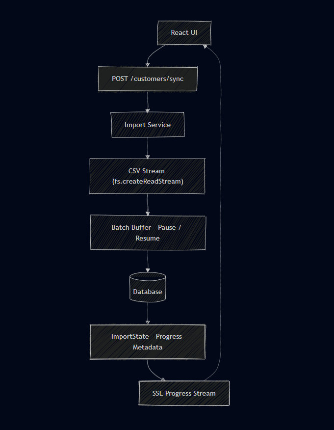

# Getonnet – Large CSV Import System

## Overview

This project demonstrates a scalable and resilient architecture for importing
very large CSV files (2GB+) into a database using Node.js without blocking
the event loop.

The system persists import progress so that realtime UI updates survive
browser refreshes and server restarts, while also supporting basic customer
CRUD operations and efficient frontend rendering.

---

## Architectural Drivers

The architecture is primarily driven by the following concerns:

- Event-loop safety in Node.js while processing very large files
- Handling 2GB+ CSV files with controlled memory usage
- Long-running import process resilience
- Persisted progress state to survive browser refresh and server restarts
- Realtime UI feedback during import
- Efficient rendering of large customer lists in the frontend

---

## Architecture & Design Decisions

| Requirement                | Design Decision                             |
| -------------------------- | ------------------------------------------- |
| 2GB+ CSV import            | fs stream with backpressure                 |
| Event-loop safety          | async streaming, no synchronous IO          |
| Resume after refresh       | persisted import_state                      |
| Resume after restart       | progress correctness preserved via database |
| Realtime progress          | Persisted state + client polling            |
| Prevent concurrent imports | single active import via DB lock            |
| Partial results            | store recently imported rows                |
| Infinite list              | pagination with client-side cache           |
| UI performance             | list virtualization                         |
| Prevent overwrite (bonus)  | updatedManuallyAt check                     |

---

## High-Level Import Flow

The following diagram illustrates the end-to-end CSV import pipeline,
including backpressure handling, progress persistence, and realtime UI updates.

---

### Realtime Transport Decision

Realtime progress updates are implemented using persisted server state
and periodic client polling. Polling was chosen over Server-Sent Events (SSE)
because the import process is long-running and progress updates are meaningful
at second-level granularity. This approach reduces operational complexity
while fully satisfying the realtime requirement.

---

### API Design Note

The import functionality is exposed under `/import` instead of `/customers`
to avoid route conflicts and to keep long-running background jobs separated
from CRUD operations.

---

## Notes

This README section focuses on architectural intent and design decisions.
Implementation details, setup instructions, and feature completeness
will be documented in later phases of the project.
